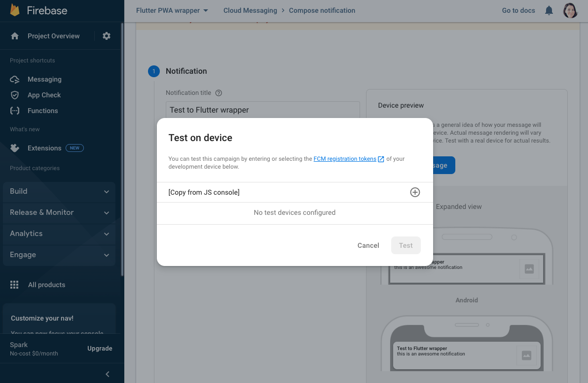

# Flutter PWA Wrapper

Wrapping your website in a native app with native push notifications and communication to the "inner" JavaScript!

## Setup 

Go to `main.dart` and edit SETTINGS:

```
class SETTINGS {
  static const title = 'Flutter PWA Wrapper';
  static const url = 'https://flutter.dev/'; 
}
```

### Create Firebase App 

Register an iOS App, add your Apple bundle ID and download `GoogleService-Info.plist`. Open `ios/Runner.xcodeproj`. Move the `GoogleService-Info.plist` inside the `Runner` folder. You can ignore the next instructions in the Firebase setup wizard.

Run the flutter app on your iOS device and click "Enable Notification" from the demo page. Copy the device token to the **Firebase Cloud Messaging > Compose notification > Send test message**:



## Development

### Run 

Either do a `flutter run` in the console (will open iOS simulator if no device is connected) or Run > Start Debugging in VSCode.

### Flutter documenation

A few resources to get you started if this is your first Flutter project:

- [Lab: Write your first Flutter app](https://flutter.dev/docs/get-started/codelab)
- [Cookbook: Useful Flutter samples](https://flutter.dev/docs/cookbook)

For help getting started with Flutter, view our
[online documentation](https://flutter.dev/docs), which offers tutorials,
samples, guidance on mobile development, and a full API reference.

### Add a plugin

`flutter pub add firebase_core`

### Generate app icons & splash screen

See [flutter_launcher_icons](https://pub.dev/packages/flutter_launcher_icons)

`flutter pub run flutter_launcher_icons:main`

See [splash_screen_view](https://pub.dev/packages/splash_screen_view)

`flutter pub run splash_screen_view:create`

### Build ios

`flutter build ipa && open build/ios/archive/Runner.xcarchive`

### Build android

Signed with `/Applications/Android\ Studio.app/Contents/jre/jdk/Contents/Home/bin/keytool -genkey -v -keystore keys/keystore.jks -keyalg RSA -keysize 2048 -validity 10000 -alias FlutterApp`

`flutter build appbundle --release --no-tree-shake-icons && open build/app/outputs/bundle/release/`